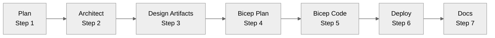

# Agentic InfraOps - Copilot Instructions

> **Agentic InfraOps** - Azure infrastructure engineered by agents. Verified. Well-Architected. Deployable.

## Quick Reference

| Rule                | Value                                                                                    |
| ------------------- | ---------------------------------------------------------------------------------------- |
| **Default Region**  | `australiaeast` (alt: `australiasoutheast`)                                              |
| **Unique Names**    | `var uniqueSuffix = uniqueString(resourceGroup().id)` in main.bicep, pass to ALL modules |
| **Key Vault**       | ≤24 chars: `kv-{short}-{env}-{suffix}`                                                   |
| **Storage Account** | ≤24 chars, lowercase+numbers only, NO hyphens                                            |
| **SQL Server**      | ≤63 chars, Azure AD-only auth                                                            |
| **Zone Redundancy** | App Service Plans: P1v4+ (not S1/P1v2)                                                   |
| **Deploy Scripts**  | `[CmdletBinding(SupportsShouldProcess)]` + `$WhatIfPreference`                           |

**Critical Files:**

- Agent definitions: `.github/agents/*.agent.md`
- Shared defaults: `.github/agents/_shared/defaults.md` (regions, tags, AVM, security)
- Plan requirements: `.github/prompts/plan-requirements.prompt.md` (comprehensive NFR capture)
- Workflow guide: `docs/reference/workflow.md`
- Reference docs: `docs/reference/` (defaults, workflow, agents-overview, bicep-patterns)
- Line endings: `.gitattributes` (use `* text=auto eol=lf` for cross-platform)
- Region abbreviations: 47 regions mapped in `.github/agents/_shared/defaults.md`

## Repository Purpose

**Agentic InfraOps** transforms requirements into deploy-ready Azure infrastructure using coordinated AI agents,
aligned with Azure Well-Architected Framework and Azure Verified Modules.

**Audience**: SI partners delivering Azure projects • IT Pros learning IaC • Customers evaluating agentic workflows

## Seven-Step Workflow



| Step | Agent            | Output                          |
| ---- | ---------------- | ------------------------------- |
| 1    | `plan`           | `01-requirements.md`            |
| 2    | `architect`      | `02-architecture-assessment.md` |
| 3    | `diagram`, `adr` | `03-des-*.md/.py/.png`          |
| 4    | `bicep-plan`     | `04-implementation-plan.md`     |
| 5    | `bicep-code`     | `infra/bicep/{project}/`        |
| 6    | `deploy`         | `06-deployment-summary.md`      |
| 7    | `docs`           | `07-*.md`                       |

**How to use agents**: `Ctrl+Alt+I` → select agent from picker → type prompt → wait for approval before next step

📖 **Full workflow details**: `docs/reference/workflow.md`

### Agent Handoff Patterns

Agents include built-in handoffs (defined in `.github/agents/*.agent.md`) for seamless workflow transitions:

```yaml
# Example from bicep-code.agent.md
handoffs:
  - label: Deploy to Azure
    agent: Deploy
    prompt: Deploy the Bicep templates to Azure. Run what-if analysis first...
    send: true
  - label: Generate As-Built Diagram
    agent: Diagram
    prompt: Generate Python diagram with '-ab' suffix. Include all deployed resources.
    send: true
```

**Common handoff chains**:

- `plan` → `architect` (with requirements)
- `architect` → `diagram` (optional design visualization)
- `architect` → `bicep-plan` (skip artifacts, go straight to planning)
- `bicep-plan` → `bicep-code` (implementation)
- `bicep-code` → `deploy` (deployment with what-if)
- `deploy` → `docs` (as-built documentation)
- `deploy` → `diagram` (as-built visualization with `-ab` suffix)

**Key principles**:

- Handoffs pass context automatically via `send: true`
- Each agent validates inputs from previous agent
- User approval required at each step (no auto-execution)
- Handoffs documented in agent definition files for transparency

## Project Structure

```
azure-agentic-infraops/
├── .github/
│   ├── agents/                  # 7 custom agents
│   │   ├── _shared/defaults.md  # Regions, tags, AVM, security
│   │   └── *.agent.md           # Agent definitions
│   ├── instructions/            # File-type specific rules
│   └── copilot-instructions.md  # THIS FILE
├── agent-output/{project}/      # Agent-generated artifacts
├── infra/bicep/                 # Generated Bicep templates
├── scenarios/                   # Demo scenarios S01-S08 (complete workflows)
├── docs/                        # Documentation
│   └── reference/               # Single source of truth (incl. workflow.md)
└── mcp/azure-pricing-mcp/       # Azure Pricing MCP server
```

## Tech Stack

| Category            | Tools                                           |
| ------------------- | ----------------------------------------------- |
| **IaC**             | Bicep                                           |
| **Automation**      | PowerShell 7+, Azure CLI 2.50+, Bicep CLI 0.20+ |
| **Platform**        | Azure (public cloud)                            |
| **AI**              | GitHub Copilot with custom agents               |
| **Dev Environment** | VS Code Dev Container (Ubuntu 24.04)            |

## Azure Pricing MCP Integration

The **Azure Pricing MCP server** (`mcp/azure-pricing-mcp/`) provides real-time Azure retail pricing to agents via Model Context Protocol.

**Integration with architect agent**:

- Automatic pricing lookups during architecture assessment (Step 2)
- SKU comparison across regions for cost optimization
- Cost estimate generation for `02-architecture-assessment.md`
- Region recommendation based on price differences

**Available MCP tools** (auto-configured in `.vscode/mcp.json`):

- `azure_price_search` - Query Azure retail prices with filters
- `azure_cost_estimate` - Calculate monthly costs with usage hours
- `azure_region_recommend` - Find cheapest regions for specific SKUs
- `azure_discover_skus` - List available SKUs for a service
- `azure_price_compare` - Compare prices across regions/SKUs

**Usage example**:

```json
// architect agent uses MCP during WAF assessment
{
  "tool": "azure_cost_estimate",
  "params": {
    "service_name": "Virtual Machines",
    "sku_name": "D4s v5",
    "region": "australiaeast",
    "hours_per_month": 730
  }
}
```

**Local testing**: `cd mcp/azure-pricing-mcp && python -m venv .venv && source .venv/bin/activate && pip install -r requirements.txt && cd src && python -m azure_pricing_mcp`

## Critical Patterns

### Unique Resource Names

```bicep
// main.bicep - Generate once, pass to ALL modules
var uniqueSuffix = uniqueString(resourceGroup().id)

module keyVault 'modules/key-vault.bicep' = {
  params: { uniqueSuffix: uniqueSuffix }
}

// modules/key-vault.bicep
param uniqueSuffix string
var kvName = 'kv-${take(projectName, 8)}-${environment}-${take(uniqueSuffix, 6)}'
```

### Required Tags

```bicep
tags: {
  Environment: 'dev'      // dev, staging, prod
  ManagedBy: 'Bicep'
  Project: projectName
  Owner: owner
}
```

### Security Defaults

| Setting                    | Value                             |
| -------------------------- | --------------------------------- |
| `supportsHttpsTrafficOnly` | `true`                            |
| `minimumTlsVersion`        | `'TLS1_2'`                        |
| `allowBlobPublicAccess`    | `false`                           |
| Managed Identities         | Preferred over connection strings |

### Azure Policy Compliance

| Policy                    | Solution                          |
| ------------------------- | --------------------------------- |
| SQL Azure AD-only auth    | `azureADOnlyAuthentication: true` |
| Zone redundancy           | Use P1v4+ SKU (not Standard)      |
| Storage shared key access | Use identity-based connections    |

## Validation Commands

```bash
# Bicep
bicep build infra/bicep/{project}/main.bicep
bicep lint infra/bicep/{project}/main.bicep

# Markdown
npm run lint:md              # Validate all markdown files
npm run lint:md:fix          # Auto-fix markdown issues

# Links (docs only, excludes _superseded)
npm run lint:links

# Artifact structure validation
npm run lint:artifact-templates      # Core artifacts (01,02,04,06)
npm run lint:cost-estimate-templates # Cost estimate templates
```

## Pre-Commit Hooks (Lefthook)

Auto-runs on `git commit` via `.lefthook.yml`:

1. **Markdown lint** - Staged `.md` files validated with markdownlint-cli2
2. **Link check** - Staged `docs/**/*.md` files checked (excluding `_superseded/`)
3. **Artifact validation** - Core artifacts validated if staged (01, 02, 04, 06)
4. **Commit message** - Conventional Commits format enforced via commitlint

Manual hook install: `npx lefthook install`

## Template-First Artifact Generation

**CRITICAL**: All agents MUST follow template-first approach when generating workflow artifacts:

1. **Read template** from `.github/templates/{artifact}.template.md`
2. **Extract H2 headings** - Note exact text and order
3. **Generate content** following template structure precisely
4. **Validate** with `npm run lint:artifact-templates`

### Artifact Structure Rules

- H2 headings MUST match template text exactly (case-sensitive)
- H2 order MUST follow template sequence for required sections
- Extra sections allowed ONLY after last required H2
- Attribution header required: `> Generated by {agent} agent | {YYYY-MM-DD}`

Example validation failure: Using `## Approval Checkpoint` when template specifies `## Approval Gate`

See `.github/agents/_shared/defaults.md` for full template-first documentation.

## Dev Container

Pre-configured with all tools. Quick start:

```bash
git clone https://github.com/jonathan-vella/azure-agentic-infraops.git
code azure-agentic-infraops
# F1 → "Dev Containers: Reopen in Container"
```

### Dev Container Environment

- **Base**: Ubuntu 24.04
- **Pre-installed tools**: Azure CLI (with Bicep), PowerShell 7+, Python 3.13, Node.js LTS, GitHub CLI, graphviz
- **Python optimizer**: `uv` package manager (installed via `astral.sh/uv/install.sh`)
- **Extensions**: 20+ VS Code extensions including Copilot, Bicep, Azure tools, Markdown tooling
- **Environment**: `AZURE_DEFAULTS_LOCATION=australiaeast`, Python unbuffered, UV cache optimization
- **Lifecycle hooks**:
  - `onCreateCommand`: apt packages, uv installer
  - `postCreateCommand`: npm install, global markdownlint-cli2, `.devcontainer/post-create.sh`
  - `postStartCommand`: lefthook install

### Key Development Workflows

```bash
# Azure authentication (required for deployments)
az login
az account set --subscription "<your-subscription-id>"

# Verify toolchain
az bicep version && pwsh --version

# MCP server testing (Azure Pricing)
cd mcp/azure-pricing-mcp
python -m venv .venv && source .venv/bin/activate
pip install -r requirements.txt
cd src && python -m azure_pricing_mcp

# Template validation
node scripts/validate-artifact-templates.mjs
```

## Demo Scenarios

The `scenarios/` folder contains complete end-to-end workflow examples (S01-S08):

| Scenario | Workload Type          | Demonstrates                           |
| -------- | ---------------------- | -------------------------------------- |
| S01      | E-commerce Platform    | Multi-tier web app, PCI DSS compliance |
| S02      | Healthcare Portal      | HIPAA compliance, data sovereignty     |
| S03      | Financial Services API | High availability, disaster recovery   |
| S04      | IoT Analytics          | Event streaming, data lakes            |
| S05      | SaaS Multi-Tenant      | Tenant isolation, cost optimization    |
| S06      | Static Website         | CDN, custom domains, CI/CD             |
| S07      | Microservices Platform | Container orchestration, service mesh  |
| S08      | Data Warehouse         | Big data, analytics, cost management   |

**Each scenario includes**:

- Full agent-output workflow (01 → 07 artifacts)
- Generated Bicep templates in `infra/bicep/`
- Architecture diagrams (design + as-built)
- ADRs and cost estimates

**Use scenarios to**:

- Learn the 7-step workflow patterns
- Understand artifact template compliance
- Study Bicep patterns for similar workloads
- Validate agent output quality

## References

- **Shared Defaults**: `.github/agents/_shared/defaults.md`
- **Workflow Guide**: `docs/reference/workflow.md`
- **Bicep Patterns**: `docs/reference/bicep-patterns.md`
- **Agents Overview**: `docs/reference/agents-overview.md`
- **Troubleshooting**: `docs/guides/troubleshooting.md`

---

**Mission**: Azure infrastructure engineered by agents—from requirements to deployed templates,
aligned with Well-Architected best practices and Azure Verified Modules.
