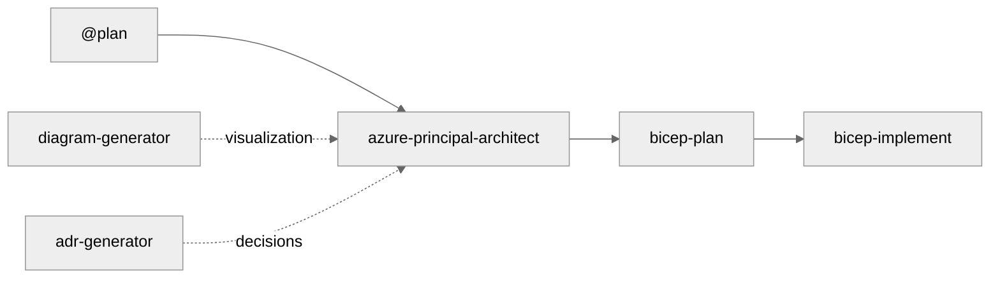

# Project Name - Copilot Instructions

This file provides context and guidance for GitHub Copilot when assisting with this repository.

> **Your Project Tagline** - Describe what your project does in one sentence.

## Quick Reference for AI Agents

**Essential Knowledge for Immediate Productivity:**

1. **Default Region**: Always use `swedencentral` (alternative: `germanywestcentral` when encountering quota issues)
2. **Unique Resource Names**: Generate `var uniqueSuffix = uniqueString(resourceGroup().id)` in main.bicep,
   pass to ALL modules
3. **Name Length Limits**: Key Vault ≤24 chars, Storage ≤24 chars (no hyphens), SQL ≤63 chars
4. **Azure SQL Auth Policy**: Azure AD-only auth for SQL Server
5. **Zone Redundancy**: App Service Plans need P1v4 SKU (not S1/P1v2) for zone redundancy
6. **Four-Step Workflow**: `@plan` → `azure-principal-architect` → `bicep-plan` → `bicep-implement`
   (each step requires approval)

**Critical Files:**

- Agent definitions: `.github/agents/*.agent.md`
- Bicep implement agent: `.github/agents/bicep-implement.agent.md` (has unique suffix guidance)
- Diagram generator: `.github/agents/diagram-generator.agent.md` (Python architecture diagrams)
- Dev container config: `.devcontainer/devcontainer.json`
- Line ending rules: `.gitattributes` (normalizes CRLF→LF for cross-platform development)

## Repository Purpose

**[YOUR PROJECT NAME]** - Describe the purpose of this repository and who it's for.

The target audience is:

- **Primary**: [Your primary users]
- **Secondary**: [Your secondary users]

## Four-Step Agent Workflow Architecture

This repository uses a **4-step agent workflow** for Azure infrastructure development:



| Step | Agent                       | Purpose                                             |
| ---- | --------------------------- | --------------------------------------------------- |
| 1    | `@plan` (Built-in)          | Create implementation plans with cost estimates     |
| 2    | `azure-principal-architect` | Azure Well-Architected Framework guidance (NO CODE) |
| 3    | `bicep-plan`                | Infrastructure planning with AVM modules            |
| 4    | `bicep-implement`           | Bicep code generation                               |

**How to Use Custom Agents:**

1. Press `Ctrl+Shift+A` or click the **Agent** button in Copilot Chat
2. Select agent from dropdown
3. Type your prompt and submit
4. **Wait for approval prompt** before proceeding to next step

## Repository Structure

```
your-project/
├── .devcontainer/                       # Pre-configured dev environment
├── .github/
│   ├── agents/                          # Custom Copilot agents
│   ├── instructions/                    # AI coding standards
│   └── copilot-instructions.md          # THIS FILE
├── .bicep-planning-files/               # Generated implementation plans
├── infra/bicep/                         # Bicep templates
└── docs/
    ├── adr/                             # Architecture Decision Records
    └── diagrams/                        # Generated architecture diagrams
```

### Naming Conventions

- **Resource Groups**: `rg-<project>-<env>`
- **Virtual Networks**: `vnet-<env>-<purpose>-<region>`
- **Subnets**: `snet-<tier>-<env>`
- **Storage Accounts**: `st<project><env><random>`
- **NSGs**: `nsg-<subnet>-<env>`

### Tags Required

All Azure resources should include:

```bicep
tags: {
  Environment: string    // dev, staging, prod
  ManagedBy: 'Bicep'    // or 'Terraform', 'ARM'
  Project: string       // Project name
  Owner: string         // Team or individual
  CostCenter: string    // Billing allocation (optional)
}
```

## Copilot Guidance for Code Generation

### Bicep Templates

When generating Bicep code:

1. **Always use latest API versions** (2023-05-01 or newer)
2. **Default location**: `swedencentral` (alternative: `germanywestcentral` if quota issues)
3. **CRITICAL - Unique resource names**: Generate suffix in main.bicep and pass to ALL modules:

   ```bicep
   var uniqueSuffix = uniqueString(resourceGroup().id)
   ```

4. **Name length constraints**:
   - Key Vault: ≤24 chars
   - Storage Account: ≤24 chars, lowercase + numbers only, NO hyphens
   - SQL Server: ≤63 chars, lowercase + numbers + hyphens
5. **Include security by default**:
   - `supportsHttpsTrafficOnly: true`
   - `minimumTlsVersion: 'TLS1_2'`
   - `allowBlobPublicAccess: false`
   - NSG deny rules at priority 4096
6. **Add descriptive comments** for all parameters and resources
7. **Include outputs** for resource IDs AND resource names

### PowerShell Scripts

When generating PowerShell code:

1. **Use approved verbs** (Get-, Set-, New-, Remove-)
2. **Include comment-based help**
3. **Add parameter validation**
4. **Implement error handling** with `try/catch`
5. **Set strict mode**: `Set-StrictMode -Version Latest`

### Documentation (Markdown)

When generating documentation:

1. **Follow markdown standards** (ATX headers, 120-char line length)
2. **Use Mermaid diagrams** for architecture and workflows
3. **Include prerequisites** section with tool versions
4. **Provide examples**
5. **Include troubleshooting** section

## Development Environment

### Dev Container (Recommended)

This repository includes a pre-configured dev container:

**Included Tools:** Terraform • Azure CLI with Bicep CLI • PowerShell 7+ • Git • Python, Node.js • VS Code extensions

**Quick Start:**

```bash
git clone https://github.com/YOUR-ORG/YOUR-PROJECT.git
code your-project
# F1 → "Dev Containers: Reopen in Container" → Wait 3-5 min
az --version && bicep --version && pwsh --version
```

### Local Validation Commands

```bash
# Bicep
bicep build infra/bicep/{project}/main.bicep
bicep lint infra/bicep/{project}/main.bicep

# Markdown
npm run lint:md
```

### Azure Subscription Requirements

- Azure subscription with Contributor access
- Resource groups: `rg-<project>-<env>`
- Clean up resources after testing

## Resources

- [Azure Bicep Documentation](https://learn.microsoft.com/azure/azure-resource-manager/bicep/)
- [Azure Naming Conventions](https://learn.microsoft.com/azure/cloud-adoption-framework/ready/azure-best-practices/naming-and-tagging)
- [GitHub Copilot for Azure](https://learn.microsoft.com/azure/developer/github/github-copilot-azure)

---

**Customize this file for your project by:**

1. Updating the project name and description
2. Adjusting the repository structure section
3. Adding project-specific naming conventions
4. Including any custom agents or workflows
