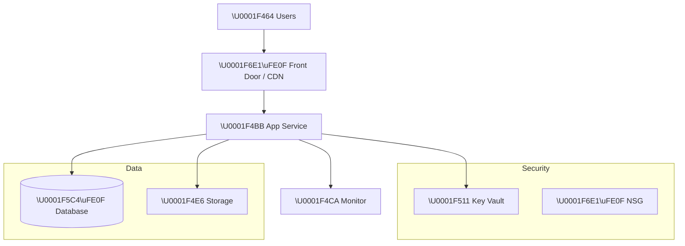

# 🏛️ Step 2: Architecture Assessment - {project-name}

[Review and approval status](README.md#-workflow-progress)

<strong>📑 Assessment Contents</strong>

- [✅ Requirements Validation](#-requirements-validation)
- [💎 Executive Summary](#-executive-summary)
- [🏛️ WAF Pillar Assessment](#-waf-pillar-assessment)
- [📦 Resource SKU Recommendations](#-resource-sku-recommendations)
- [🎯 Architecture Decision Summary](#-architecture-decision-summary)
- [🚀 Implementation Handoff](#-implementation-handoff)
- [🔒 Approval Gate](#-approval-gate)
- [References](#references)

> Generated by architect agent | {date}

| ⬅️ Previous                              | 📑 Index            | Next ➡️                                            |
| ---------------------------------------- | ------------------- | -------------------------------------------------- |
| [01-requirements.md](01-requirements.md) | [README](README.md) | [03-des-cost-estimate.md](03-des-cost-estimate.md) |

## ✅ Requirements Validation

| Requirement Area        | Status                               | Validation Notes |
| ----------------------- | ------------------------------------ | ---------------- |
| NFRs (SLA, RTO, RPO)    | ✅ Defined / ⚠️ Partial / ❌ Missing | {notes}          |
| Compliance requirements | ✅ Defined / ⚠️ Partial / ❌ Missing | {notes}          |
| Budget (approximate)    | ✅ Defined / ⚠️ Partial / ❌ Missing | {notes}          |
| Scale requirements      | ✅ Defined / ⚠️ Partial / ❌ Missing | {notes}          |
| Security controls       | ✅ Defined / ⚠️ Partial / ❌ Missing | {notes}          |
| Data residency          | ✅ Defined / ⚠️ Partial / ❌ Missing | {notes}          |

> [!WARNING]
> Any ❌ items above must be resolved before proceeding to implementation.

### Required Capability Dependencies

Capture only capabilities required by the approved brief. Identify the consumer and every dependency needed for
that capability, including operator/client origin, identity, routing, DNS, ownership and cost where applicable.
Do not infer missing requirements from a generic resource list or assume every workload requires private monitoring.

| Required capability | Consumer/producer | Dependency and owner | Evidence scope/date | Design status | Runtime status |
| --- | --- | --- | --- | --- | --- |
| {capability} | {client or service} | {dependency and accountable owner} | {source, observation date, assumptions} | Designed / Unresolved / Approved deferral | Unverified / Verified / Not applicable |

Missing required design paths block implementation approval, not specifically authorized review of alternatives.
Capability deferrals need the accepting owner, approval reference, affected consumers and revisit condition;
mandatory security obligations cannot be deferred. Runtime status stays unverified until an authorized observation.
Planner mirrors this matrix into `capability_checks` for readiness-mode contracts; never rewrite approved legacy
artifacts automatically. Shared-resource absence and capacity/pricing estimates retain their scope and assumptions.

---

## 💎 Executive Summary

Brief narrative summary of the workload and recommended approach.

### Recommended Architecture

> Replace the above with actual architecture for the project.

---

## 🏛️ WAF Pillar Assessment

### Overall Scores

| Pillar                    | Score | Confidence       | Summary |
| ------------------------- | ----- | ---------------- | ------- |
| 🔒 Security               | /10   | High / Med / Low |         |
| 🔄 Reliability            | /10   | High / Med / Low |         |
| ⚡ Performance            | /10   | High / Med / Low |         |
| 💰 Cost Optimization      | /10   | High / Med / Low |         |
| 🔧 Operational Excellence | /10   | High / Med / Low |         |

**Primary Pillar Optimized**: {pillar}
**Trade-offs Accepted**: {trade-offs}

> Generate `02-waf-scores.png` using the pattern in `apex-python-diagrams` skill →
> `references/waf-cost-charts.md` → **Chart 1 – WAF Pillar Scores**.
> Replace placeholder scores with the actual pillar values before running.

---

### 🔒 Security Assessment ({score}/10)

**Strengths:**

- List strengths

**Gaps:**

- List gaps

**Recommendations:**

1. Recommendation 1
2. Recommendation 2

### 🔄 Reliability Assessment ({score}/10)

**Strengths:**

- List strengths

**Gaps:**

- List gaps

**Recommendations:**

1. Recommendation 1
2. Recommendation 2

### ⚡ Performance Assessment ({score}/10)

**Strengths:**

- List strengths

**Gaps:**

- List gaps

**Recommendations:**

1. Recommendation 1
2. Recommendation 2

### 💰 Cost Assessment ({score}/10)

| Metric           | Value                              |
| ---------------- | ---------------------------------- |
| Monthly Estimate | ~${X}/month                        |
| Annual Estimate  | ~${X}/year                         |
| Budget Status    | {✅ Within budget / ⚠️ Over by $X} |
| Confidence       | {High / Medium / Low}              |

> 📎 Full cost breakdown: [03-des-cost-estimate.md](03-des-cost-estimate.md)

**Cost Optimization Applied:**

- List optimizations

### 🔧 Operational Excellence Assessment ({score}/10)

**Strengths:**

- List strengths

**Gaps:**

- List gaps

**Recommendations:**

1. Recommendation 1
2. Recommendation 2

---

## 📦 Resource SKU Recommendations

| Service   | Recommended SKU | Configuration | Monthly Est. | Justification |
| --------- | --------------- | ------------- | ------------ | ------------- |
| {service} | {sku}           | {config}      | ${amount}    | {why}         |

<strong>{Service 1}</strong> — Pricing Tier Comparison

| Tier     | vCPU   | RAM    | Price/mo | Fits?        |
| -------- | ------ | ------ | -------- | ------------ |
| Basic    | {spec} | {spec} | ${price} | ❌ / ⚠️ / ✅ |
| Standard | {spec} | {spec} | ${price} | ❌ / ⚠️ / ✅ |
| Premium  | {spec} | {spec} | ${price} | ❌ / ⚠️ / ✅ |

**Selected**: {tier} — {justification}

<strong>{Service 2}</strong> — Pricing Tier Comparison

| Tier     | Capacity | Price/mo | Fits?        |
| -------- | -------- | -------- | ------------ |
| Basic    | {spec}   | ${price} | ❌ / ⚠️ / ✅ |
| Standard | {spec}   | ${price} | ❌ / ⚠️ / ✅ |
| Premium  | {spec}   | ${price} | ❌ / ⚠️ / ✅ |

**Selected**: {tier} — {justification}

---

## 🎯 Architecture Decision Summary

| Decision   | Choice | Rationale |
| ---------- | ------ | --------- |
| Decision 1 |        |           |
| Decision 2 |        |           |

### Top Architecture Risks

| Risk   | WAF Pillar               | Likelihood                  | Impact                      | Mitigation   |
| ------ | ------------------------ | --------------------------- | --------------------------- | ------------ |
| {risk} | {🔒 / 🔄 / ⚡ / 💰 / 🔧} | {🔴 High / 🟡 Med / 🟢 Low} | {🔴 High / 🟡 Med / 🟢 Low} | {mitigation} |

> Limit to the top 5 architecture-level risks. Pillar-specific gaps remain in the WAF assessment above.

---

## 🚀 Implementation Handoff

### Handoff Readiness

Record substantive readiness and prerequisites here. Current architecture and independent cost-feasibility
review evidence and human approval are recorded in recall, decision sidecars and the project index.
Use stable links to those records; do not rewrite this assessment after review to update status.
An assessment write is not approval.
After the gate, derive the next human handoff from the workflow graph and
`decisions.skip_design`: optional Design (Step 3), then Governance (Step 3.5),
or Governance directly. Never route directly to implementation planning.

| Parameter      | Value                                  |
| -------------- | -------------------------------------- |
| Region         | {region}                               |
| Environment    | {env}                                  |
| Budget         | ${budget}/month (estimated: ${actual}) |
| Resource Count | {count}                                |

### Resources to Provision

| #   | Resource   | SKU   | Key Config |
| --- | ---------- | ----- | ---------- |
| 1   | {resource} | {sku} | {config}   |
| 2   | {resource} | {sku} | {config}   |

### Security Requirements for Implementation

| Requirement        | Implementation              |
| ------------------ | --------------------------- |
| {security feature} | {how to implement in Bicep} |

### Monitoring Requirements for Implementation

| Requirement          | Implementation              |
| -------------------- | --------------------------- |
| {monitoring feature} | {how to implement in Bicep} |

---

## 🔒 Approval Gate

> [!IMPORTANT]
> **🏗️ Architecture Assessment: approval tracked separately**
>
> | Pillar      | Score |
> | ----------- | ----- |
> | Security    | X/10  |
> | Reliability | X/10  |
> | Performance | X/10  |
> | Cost        | X/10  |
> | Operations  | X/10  |
>
> **Estimated Monthly Cost**: ~$X ({within budget / over budget by $Y})
>
> **Confidence Level**: {High / Medium / Low}
>
> Current status: [project workflow progress](README.md#-workflow-progress) and recall Step 2 decisions.
> Review evidence: [architecture findings](challenge-findings-architecture.json) and
> [cost-feasibility findings](challenge-findings-cost-estimate.json); use actual pass paths in deep mode.
> Per-finding dispositions: [decision sidecar](challenge-findings-architecture-decisions.json), when findings exist.
>
> Request approval only after required review evidence is ready. Otherwise record
> the blocked state and return to the owning agent; do not mark Step 2 complete.
> Record the approver and decision timestamp outside this reviewed document. Do not toggle checkboxes or badges here.

---

## References

> [!NOTE]
> 📚 The following Microsoft Learn resources informed this assessment.

| Topic                      | Link                                                                                        |
| -------------------------- | ------------------------------------------------------------------------------------------- |
| Well-Architected Framework | [Overview](https://learn.microsoft.com/azure/well-architected/)                             |
| Security Checklist         | [WAF Security](https://learn.microsoft.com/azure/well-architected/security/checklist)       |
| Reliability Checklist      | [WAF Reliability](https://learn.microsoft.com/azure/well-architected/reliability/checklist) |
| Cost Optimization          | [WAF Cost](https://learn.microsoft.com/azure/well-architected/cost-optimization/checklist)  |
| Azure Pricing Calculator   | [Calculator](https://azure.microsoft.com/pricing/calculator/)                               |

---

_Assessment performed using Azure Well-Architected Framework. Pricing data from Azure Resource Manager MCP ({date})._

---

| ⬅️ [01-requirements.md](01-requirements.md) | 🏠 [Project Index](README.md) | ➡️ [03-des-cost-estimate.md](03-des-cost-estimate.md) |
| ------------------------------------------- | ----------------------------- | ----------------------------------------------------- |

