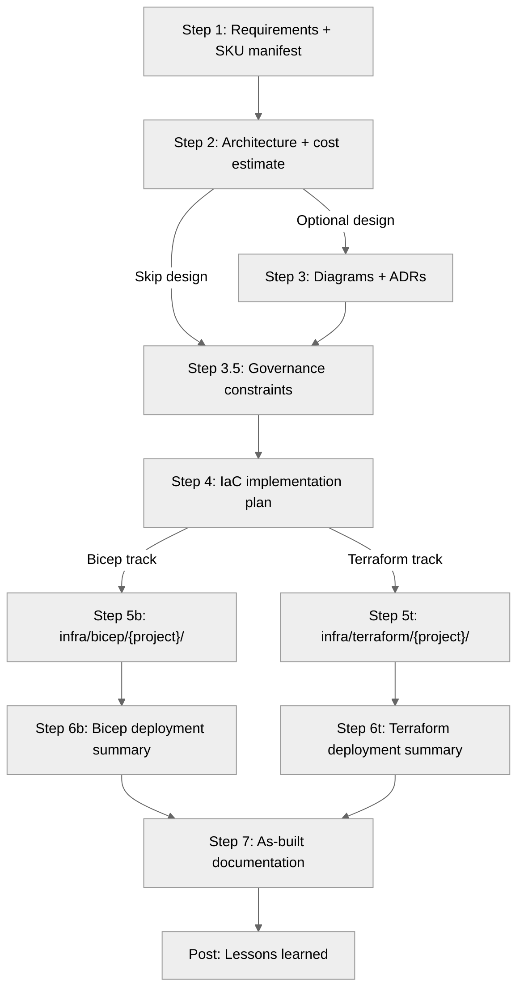

<!-- ref:repo-architecture-v1 -->

# Repo Architecture Reference

> For use by the `apex-docs-writer` skill. Model and harness guidance updated: 2026-09-11.
> Agent frontmatter owns assignments; inventories below are documentation, not runtime overrides.

## Workspace Root Structure

```text
apex/  (APEX)
├── .github/
││   ├── agents/              # Agent definitions + subagents
││   │   └── _subagents/      # Validation subagents (lint, what-if, review)
││   ├── skills/              # Skill definitions (see count-manifest.json)
││   │   └── apex-azure-artifacts/templates/ # Artifact templates
││   ├── instructions/        # File-type instruction files
├── agent-output/{project}/  # Agent-generated artifacts (01-07)
├── site/src/content/docs/   # Published documentation
├── site/public/             # Explorer graph, images, and static assets
├── infra/bicep/             # Bicep module library
├── tools/
│   ├── apex-recall/        # Progressive session recall CLI
│   ├── apex-prompts/       # Local prompt adapters and reference material
│   ├── registry/           # Agent registry + count manifest
│   ├── schemas/            # JSON schemas
│   ├── scripts/            # Validation and maintenance scripts
│   └── tests/              # Regression tests and execution plans
└── tmp/                    # Scratch space (gitignored for outputs)
```

## Agent Inventory

See `tools/registry/count-manifest.json` for canonical counts.

### Primary Agents

| Agent             | File                             | Model                     | Step | Artifacts                       |
| ----------------- | -------------------------------- | ------------------------- | ---- | ------------------------------- |
| Orchestrator      | `01-orchestrator.agent.md`       | MAI-Code-1.1-Flash        | All  | Orchestration                   |
| Requirements      | `02-requirements.agent.md`       | GPT-5.6 Sol (copilot)               | 1    | `01-requirements.md`            |
| Architect         | `03-architect.agent.md`          | GPT-5.6 Sol (copilot)               | 2    | `02-architecture-assessment.md` |
| Design            | `04-design.agent.md`             | GPT-5.6 Terra (copilot)             | 3    | `03-des-*.{py,png,svg,md}`      |
| Governance        | `04g-governance.agent.md`        | GPT-5.6 Luna (copilot)              | 3.5  | `04-governance-constraints.md`  |
| IaC Plan          | `05-iac-planner.agent.md`        | GPT-5.6 Sol (copilot)               | 4    | `04-implementation-plan.md`     |
| Bicep Code        | `06b-bicep-codegen.agent.md`     | GPT-5.6 Terra (copilot)             | 5b   | Bicep in `infra/bicep/`         |
| Bicep Deploy      | `07b-bicep-deploy.agent.md`      | GPT-5.6 Luna (copilot)              | 6b   | `06-deployment-summary.md`      |
| Terraform Code    | `06t-terraform-codegen.agent.md` | GPT-5.6 Terra (copilot)             | 5t   | Terraform in `infra/terraform/` |
| Terraform Deploy  | `07t-terraform-deploy.agent.md`  | GPT-5.6 Luna (copilot)              | 6t   | `06-deployment-summary.md`      |
| As-Built          | `08-as-built.agent.md`           | GPT-5.6 Terra (copilot)             | 7    | `07-ab-*.md` docs suite         |
| Diagnose          | `09-diagnose.agent.md`           | GPT-5.6 Terra (copilot)             | —    | Diagnostic reports              |
| Challenger        | `10-challenger.agent.md`         | GPT-5.6 Terra (copilot)             | —    | Challenge findings              |
| Context Optimizer | `11-context-optimizer.agent.md`  | GPT-5.6 Sol (copilot)               | —    | Optimization reports            |

All production main agents, including `10-Challenger`, use `disable-model-invocation: true`.
Use human handoffs; an unavailable reviewer is not permission for a nested wrapper fallback.
The E2E launch subsystem is retired. Preserve production lessons and historical artifacts/schema compatibility.

### Validation Subagents (in `_subagents/`)

| Subagent                    | File                                   | Purpose                             |
| --------------------------- | -------------------------------------- | ----------------------------------- |
| bicep-validate-subagent     | `bicep-validate-subagent.agent.md`     | Lint + AVM/security code review     |
| bicep-whatif-subagent       | `bicep-whatif-subagent.agent.md`       | Deployment preview (what-if)        |
| challenger-review-subagent  | `challenger-review-subagent.agent.md`  | Adversarial artifact review         |
| cost-estimate-subagent      | `cost-estimate-subagent.agent.md`      | ARM MCP pricing queries             |
| policy-precheck-subagent    | `policy-precheck-subagent.agent.md`    | Live deployment policy precheck     |
| terraform-plan-subagent     | `terraform-plan-subagent.agent.md`     | Deployment preview (terraform plan) |
| terraform-validate-subagent | `terraform-validate-subagent.agent.md` | Lint + AVM-TF/security code review  |

The review worker uses `GPT-5.6 Terra (copilot)`; the other workers use `GPT-5.6 Luna (copilot)`.
Sol, Terra, and Luna labels are not evidence of runtime cost-tier eligibility,
availability, or API support. Check actual harness capability; never infer a fallback model.

### Shared Knowledge (via Skills)

All shared context previously in `_shared/` is now consolidated into skills:

| Skill             | Replaces                                                                                    |
| ----------------- | ------------------------------------------------------------------------------------------- |
| `apex-azure-defaults`  | `defaults.md`, `avm-pitfalls.md`, `research-patterns.md`, `service-lifecycle-validation.md` |
| `apex-azure-artifacts` | `documentation-styling.md`, all template H2 structures                                      |

## Skill Catalog

See `tools/registry/count-manifest.json` for canonical skill counts.
Each subdirectory under `.github/skills/` with a `SKILL.md` is one skill.

| Skill                         | Folder                         | Category            | Triggers                                   |
| ----------------------------- | ------------------------------ | ------------------- | ------------------------------------------ |
| `apex-agent-authoring` | `apex-agent-authoring/` | Authoring | "assess agents", "assess .github" |
| `apex-azure-adr`                   | `apex-azure-adr/`                   | Document Creation   | "create ADR", "document decision"          |
| `apex-azure-artifacts`             | `apex-azure-artifacts/`             | Artifact Generation | "generate documentation"                   |
| `apex-azure-bicep-patterns`        | `apex-azure-bicep-patterns/`        | IaC Patterns        | "bicep pattern", "hub-spoke"               |
| `apex-azure-cloud-migrate`         | `apex-azure-cloud-migrate/`         | Migration           | "migrate to Azure", "cross-cloud"          |
| `apex-azure-compliance`            | `apex-azure-compliance/`            | Security            | "compliance scan", "security audit"        |
| `apex-azure-compute`               | `apex-azure-compute/`               | Compute             | "recommend VM", "VM sizing"                |
| `apex-azure-cost-optimization`     | `apex-azure-cost-optimization/`     | Cost                | "optimize costs", "reduce spending"        |
| `apex-azure-defaults`              | `apex-azure-defaults/`              | Azure Conventions   | "azure defaults", "naming"                 |
| `apex-azure-deploy`                | `apex-azure-deploy/`                | Deployment          | "azd up", "deploy", "go live"              |
| `apex-azure-diagnostics`           | `apex-azure-diagnostics/`           | Troubleshooting     | "troubleshoot", "KQL", "health check"      |
| `apex-python-diagrams`             | `apex-python-diagrams/`             | Document Creation   | "create chart", "WAF chart"                |
| `apex-mermaid`                     | `apex-mermaid/`                     | Document Creation   | "mermaid diagram", "flowchart"             |
| `apex-azure-kusto`                 | `apex-azure-kusto/`                 | Data & Analytics    | "KQL queries", "Azure Data Explorer"       |
| `apex-azure-prepare`               | `apex-azure-prepare/`               | Deployment          | "create app", "prepare Azure"              |
| `apex-azure-quotas`                | `apex-azure-quotas/`                | Capacity            | "check quotas", "service limits"           |
| `apex-azure-rbac`                  | `apex-azure-rbac/`                  | Identity            | "RBAC role", "least privilege"             |
| `apex-azure-resources`             | `apex-azure-resources/`             | Discovery           | "list resources", "resource diagram"       |
| `apex-azure-storage`               | `apex-azure-storage/`               | Storage             | "blob storage", "file shares"              |
| `apex-azure-validate`              | `apex-azure-validate/`              | Validation          | "validate app", "preflight checks"         |
| `apex-context-management`          | `apex-context-management/`          | Meta                | "context optimization", "compress context" |
| `apex-docs-writer`                 | `apex-docs-writer/`                 | Documentation       | "update docs", "check staleness"           |
| `apex-entra-app-registration`      | `apex-entra-app-registration/`      | Identity            | "app registration", "Entra ID"             |
| `apex-github-operations`           | `apex-github-operations/`           | Workflow            | "commit", "create issue", "create PR"      |
| `apex-golden-principles`           | `apex-golden-principles/`           | Meta                | "operating principles", "agent rules"      |
| `apex-iac-common`                  | `apex-iac-common/`                  | IaC Patterns        | "deploy patterns", "circuit breaker"       |
| `apex-microsoft-docs`              | `apex-microsoft-docs/`              | Documentation       | "Azure docs", "quickstart"                 |
| `apex-terraform-patterns`          | `apex-terraform-patterns/`          | IaC Patterns        | "terraform pattern", "AVM-TF", "HCL"       |
| `apex-terraform-search-import`     | `apex-terraform-search-import/`     | IaC Import          | "import resources", "terraform import"     |
| `apex-terraform-test`              | `apex-terraform-test/`              | IaC Testing         | "terraform test", ".tftest.hcl"            |
| `apex-workflow-engine`             | `apex-workflow-engine/`             | Workflow            | "workflow DAG", "step routing"             |

This grouped index is not a routing override. Enumerate current `SKILL.md` files for
the complete inventory, including manual Host entries. Procedure ownership:

- [Doc gardening](doc-gardening.md), [peer review](plan-docs-peer-review.md), and
    [Astro review](review-astro-docs.md) belong to docs-writer and retain their distinct modes.
- [Agent assessment](../../apex-agent-authoring/references/assess-agents.md) and
    [.github assessment](../../apex-agent-authoring/references/assess-github-folder.md)
    belong to agent-authoring; assessment plans do not authorize edits.
- [Context-management](../../apex-context-management/SKILL.md) retains runtime compression,
    context audit, and log export. A supplied profile is evidence, not a new runtime owner.
- [Workflow-engine](../../apex-workflow-engine/SKILL.md) retains workflow entry and recovery.

## Template Inventory

All in `.github/skills/apex-azure-artifacts/templates/`. Naming: `{step}-{name}.template.md`.
See `tools/registry/count-manifest.json` for canonical counts.

| Template                                  | Artifact             | Validation        |
| ----------------------------------------- | -------------------- | ----------------- |
| `00-session-state.template.json`          | Session State        | JSON schema       |
| `01-requirements.template.md`             | Requirements         | Standard (strict) |
| `02-architecture-assessment.template.md`  | WAF Assessment       | Standard (strict) |
| `03-des-cost-estimate.template.md`        | Design Cost Estimate | Cost validator    |
| `04-governance-constraints.template.md`   | Governance           | Standard (strict) |
| `04-implementation-plan.template.md`      | Implementation Plan  | Standard (strict) |
| `04-preflight-check.template.md`          | Preflight Check      | Standard (strict) |
| `05-implementation-reference.template.md` | Impl Reference       | Relaxed           |
| `06-deployment-summary.template.md`       | Deploy Summary       | Standard (strict) |
| `07-ab-cost-estimate.template.md`         | As-Built Cost        | Cost validator    |
| `07-backup-dr-plan.template.md`           | Backup/DR Plan       | Relaxed           |
| `07-compliance-matrix.template.md`        | Compliance Matrix    | Relaxed           |
| `07-design-document.template.md`          | Design Document      | Relaxed           |
| `07-documentation-index.template.md`      | Doc Index            | Relaxed           |
| `07-operations-runbook.template.md`       | Ops Runbook          | Relaxed           |
| `07-resource-inventory.template.md`       | Resource Inventory   | Relaxed           |
| `09-lessons-learned.template.md`          | Lessons Learned      | Relaxed           |
| `PROJECT-README.template.md`              | Project README       | —                 |

## Instruction File Map

Use the [instruction directory](../../../instructions/) for the current inventory and
each file's `applyTo` frontmatter for authoritative scopes. The
[count manifest](../../../../tools/registry/count-manifest.json) owns inventory counts;
the [published instruction reference](../../../../site/src/content/docs/concepts/how-it-works/skills-and-instructions.md)
explains their role. Authoring scope matches do not prove runtime instruction attachment.

## Artifact Flow (Multi-Step Workflow)

The [workflow graph](../../apex-workflow-engine/templates/workflow-graph.json) owns routing;
the [workflow table](../../../../AGENTS.md#agent-workflow) defines review and human approval requirements.
This artifact-flow summary does not replace those gates.



## Key Files for Documentation Maintenance

These files contain counts, tables, or version references that need
updating when agents or skills change:

| File                                          | Contains                                |
| --------------------------------------------- | --------------------------------------- |
| `site/src/content/docs/`                      | Published documentation pages           |
| `docs.instructions.md`                        | Site docs standards                     |
| `QUALITY_SCORE.md`                            | Project health grades (doc-gardening)   |
| `tools/tests/exec-plans/tech-debt-tracker.md` | Tech debt inventory                     |
| `VERSION.md`                                  | Canonical version number                |
| `CHANGELOG.md`                                | Release history                         |
| `README.md` (root)                            | Overview, project structure, tech stack |

## Published Source Index

Use [the site sidebar](../../../../site/astro.config.mjs) for navigation and
walk [the content directory](../../../../site/src/content/docs/) for source files.
The [prompt reference](../../../../site/src/content/docs/reference/prompts/repository-prompts.md)
distinguishes Local adapters from manual Host entries. The
[Explorer source](../../../../tools/scripts/generate-explorer-graph.mjs) emits source
invocation flags and declared context, with explicit defaults for skills. Its metadata
does not establish runtime discovery, model eligibility, or instruction attachment.

## Skill Discovery & Auto-Invocation

Skills are discovered from SKILL.md metadata and loaded on demand, not through
`tools:` arrays in agent definitions. Local prompt files are adapters; Agent Host
uses shared skills, which inherit the caller's model/tools rather than binding an
agent or granting permissions. Select the owning main agent before consequential work.
Legacy location/discovery settings are not a security boundary. Verify Local and
Agent Host discovery and routing separately; source checks do not certify runtime behavior.

### Agent-Referenced Skills

These skills are explicitly referenced in agent body text via mandatory
"Read skills FIRST" instructions:

| Skill               | Referenced By                                              |
| ------------------- | ---------------------------------------------------------- |
| `apex-azure-defaults`    | all primary agents                                         |
| `apex-azure-artifacts`   | requirements, architect, iac-planner, deploy, orchestrator |
| `apex-python-diagrams`   | architect, design, iac-planner, as-built agents             |
| `apex-azure-adr`         | design agent                                               |
| `apex-github-operations` | orchestrator, iac-planner agents                           |

### General-Purpose Skills

Descriptions support discovery subject to invocation flags. `user-invocable` defaults
to `true`, and `disable-model-invocation` defaults to `false`. Manual Host entries set
the latter to `true`; select their required owner before invoking them.

- `apex-docs-writer`: documentation maintenance, gardening, and reviews.
- `apex-agent-authoring`: agent authoring and gated authoring-asset assessments.
- `apex-host-workflow-start`: explicit start or `resume` operation; recovery is not a separate skill.
- `apex-host-git-commit` and `apex-host-debug-log-export`: separate manual operational entries.

### Instruction Files (Separate Mechanism)

Instruction files (`.github/instructions/*.instructions.md`) use frontmatter
`applyTo` globs, not `.gitattributes`. Authoring matches do not prove runtime
attachment: keep essential role, security, approval, output, and stop rules in
main agent bodies and explicitly load missing required guidance. Instructions
are file-type-scoped rules, not invokable skills; vendor-authoring references
are on-demand authoring/audit material, not automatic production reads.
