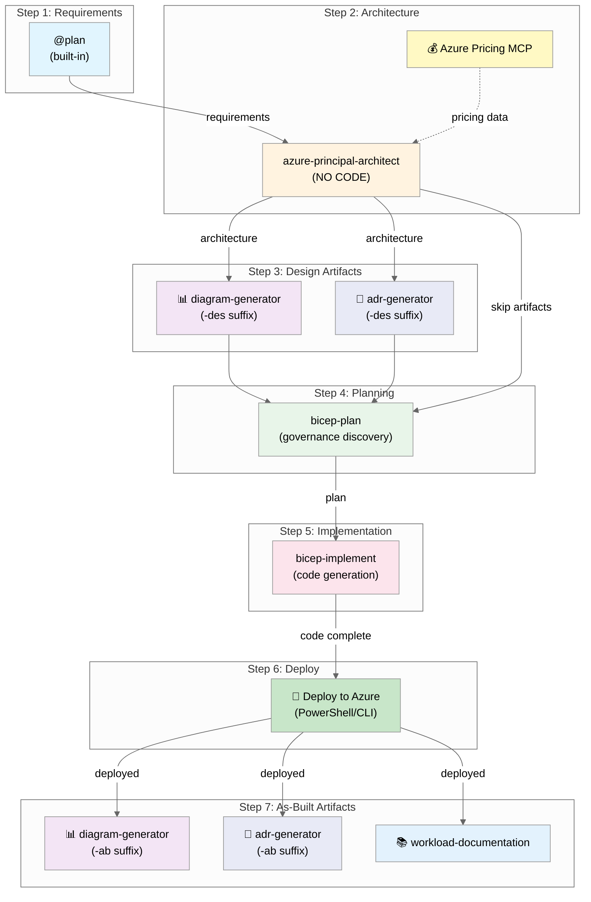

# Project Name

> **Your Project Tagline** - One sentence describing your project.

## Overview

[Describe what this project does and why it exists]

## Quick Start

### Prerequisites

- Docker Desktop (or alternative: Podman, Colima, Rancher Desktop)
- VS Code with Dev Containers extension
- Azure subscription with Contributor access

### Getting Started

```bash
# Clone repository
git clone https://github.com/YOUR-ORG/YOUR-PROJECT.git
cd your-project

# Open in VS Code
code .

# Reopen in Dev Container
# F1 → "Dev Containers: Reopen in Container"
# Wait 3-5 minutes for initial build

# Authenticate with Azure
az login
az account set --subscription "<your-subscription-id>"

# Verify tools
terraform version && az bicep version && pwsh --version
```

## Agent Workflow



## Workflow Steps

| Step | Agent/Phase                 | Purpose                              | Creates                                   | Required |
| ---- | --------------------------- | ------------------------------------ | ----------------------------------------- | -------- |
| 1    | `@plan` (built-in)          | Gather requirements                  | `01-requirements.md`                      | ✅ Yes   |
| 2    | `azure-principal-architect` | WAF assessment                       | `02-architecture-assessment.md`           | ✅ Yes   |
| 3    | Design Artifacts            | Visualize design, document decisions | `03-des-*` diagrams + cost + ADRs         | Optional |
| 4    | `bicep-plan`                | Implementation planning + governance | `04-*` plan + governance constraints      | ✅ Yes   |
| 5    | `bicep-implement`           | Code generation                      | Bicep templates + `05-*` reference        | ✅ Yes   |
| 6    | Deploy                      | Deploy to Azure                      | `06-deployment-summary.md`                | ✅ Yes   |
| 7    | As-Built Artifacts          | Document final state                 | `07-ab-*` diagrams + ADRs + workload docs | Optional |

**Usage:** Press `Ctrl+Shift+A` in VS Code to select an agent.

## Project Structure

```
├── .devcontainer/           # Dev container configuration
├── .github/
│   ├── agents/              # Copilot agents
│   ├── instructions/        # AI coding standards
│   ├── prompts/             # Reusable prompt templates
│   └── copilot-instructions.md
├── .bicep-planning-files/   # Implementation plans (bicep-plan output)
├── agent-output/            # Agent-generated artifacts
├── infra/bicep/             # Bicep templates
├── mcp/azure-pricing-mcp/   # Azure Pricing MCP server
└── docs/
    ├── adr/                 # Architecture Decision Records
    ├── reference/           # Defaults, patterns, agents
    └── workflow/            # Agent workflow documentation
```

## Documentation

- [Copilot Instructions](.github/copilot-instructions.md)
- [Documentation Hub](docs/README.md)
- [Architecture Decisions](docs/adr/README.md)

## Development

### Validation Commands

```bash
# Bicep
bicep build infra/bicep/{project}/main.bicep
bicep lint infra/bicep/{project}/main.bicep

# Markdown
npm run lint:md
```

### Deployment

```powershell
cd infra/bicep/{project}
./deploy.ps1 -WhatIf  # Preview changes
./deploy.ps1          # Deploy
```

## Contributing

1. Create a feature branch
2. Make your changes
3. Run `npm run lint:md` to validate markdown
4. Submit a pull request

## Additional Resources

For advanced usage, reference implementations, or additional documentation, see the main repository:
[azure-agentic-infraops](https://github.com/jonathan-vella/azure-agentic-infraops)

## License

[MIT](LICENSE)
