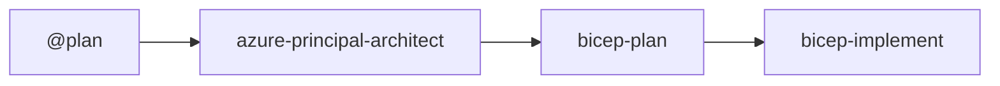

# Agentic InfraOps Template

> **Skeleton repository** for [azure-agentic-infraops](https://github.com/jonathan-vella/azure-agentic-infraops)
>
> Contains all essential components to run custom Copilot agents for Azure infrastructure development.

## Included Components

### Core Configuration

| Component                         | Purpose                                       |
| --------------------------------- | --------------------------------------------- |
| `.devcontainer/`                  | Pre-configured dev container with Azure tools |
| `.github/agents/`                 | Custom Copilot agents for the workflow        |
| `.github/instructions/`           | AI coding standards and best practices        |
| `.github/prompts/`                | Reusable prompt templates                     |
| `.github/copilot-instructions.md` | Main Copilot context file                     |
| `.husky/`                         | Git hooks for quality enforcement             |
| `.vscode/`                        | VS Code and MCP server configuration          |
| `mcp/azure-pricing-mcp/`          | Azure Pricing MCP server                      |

### Documentation

| Component         | Purpose                            |
| ----------------- | ---------------------------------- |
| `docs/reference/` | Defaults, patterns, agents         |
| `docs/workflow/`  | Seven-step agent workflow guide    |
| `docs/adr/`       | Architecture Decision Records      |
| `docs/guides/`    | Quickstart and troubleshooting     |

### Quality Tooling

| Component                  | Purpose                           |
| -------------------------- | --------------------------------- |
| `package.json`             | Husky + markdownlint dependencies |
| `.markdownlint-cli2.jsonc` | Markdown linting configuration    |
| `.gitattributes`           | Line ending normalization         |
| `.gitignore`               | Standard ignore patterns          |

### GitHub Workflows

| Workflow                      | Purpose                                         |
| ----------------------------- | ----------------------------------------------- |
| `markdown-lint.yml`           | CI markdown validation                          |
| `update-version.yml`          | Automated version bumping                       |
| `sync-from-upstream.yml`      | Weekly sync from main repository                |
| `ms-learn-monitor.yml`        | Microsoft Learn link validation                 |

## Staying Up to Date

This template automatically syncs from the main repository weekly via the
**Sync from Upstream** workflow (`.github/workflows/sync-from-upstream.yml`).

- **Schedule**: Every Monday at 06:00 UTC
- **Manual trigger**: Actions → Sync from Upstream → Run workflow
- **Dry run option**: Preview changes without creating a PR

The sync includes:
- Agent definitions and instructions
- Dev container configuration
- MCP server updates
- Reference documentation
- Config file updates

**Excluded from sync** (template-specific):
- `scenarios/` - Demo scenarios
- `docs/presenter/` - Presentation materials
- `README.md` - Template maintains its own

## Quick Start

1. Use this template or clone the repository
2. Open in VS Code with Dev Containers
3. Run `npm install` to set up Husky hooks
4. Start using agents: `Ctrl+Shift+A` → select an agent

## Customization

After cloning, update these files for your project:

| File                              | Update                            |
| --------------------------------- | --------------------------------- |
| `package.json`                    | Name, description, repository URL |
| `.github/copilot-instructions.md` | Project-specific context          |
| `.github/agents/*.agent.md`       | Domain-specific agent behavior    |

## Agent Workflow

See [Workflow Guide](docs/workflow/WORKFLOW.md) for the complete seven-step workflow.

## Related

- **Main repository**: [azure-agentic-infraops](https://github.com/jonathan-vella/azure-agentic-infraops)
- **Workflow documentation**: [docs/workflow/WORKFLOW.md](docs/workflow/WORKFLOW.md)
- **Agent reference**: [docs/reference/agents-overview.md](docs/reference/agents-overview.md)
