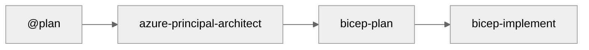

# Project Documentation

Welcome to the project documentation hub.

## Quick Links

| Document                              | Description                        |
| ------------------------------------- | ---------------------------------- |
| [Architecture Decision Records](adr/) | Documented architectural decisions |
| [Diagrams](diagrams/)                 | Architecture diagrams              |

## Getting Started

1. Open this project in VS Code
2. Reopen in Dev Container (`F1` → "Dev Containers: Reopen in Container")
3. Authenticate with Azure: `az login`
4. Start using agents: `Ctrl+Shift+A`

## Agent Workflow

See [Copilot Instructions](../.github/copilot-instructions.md) for full workflow documentation.
