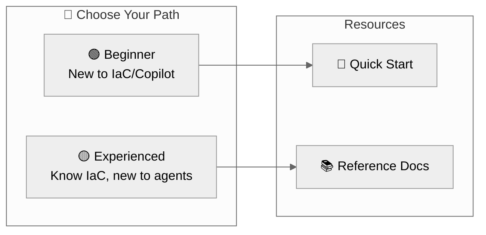

# Documentation Hub

> **Agentic InfraOps v3.6.0** |
> 🔗 [aka.ms/agenticinfraops](https://aka.ms/agenticinfraops)

Welcome to the Agentic InfraOps documentation center.

| Path               | Start Here                       |
| ------------------ | -------------------------------- |
| 🟢 **Beginner**    | [Quick Start](guides/quickstart.md) |
| 🟡 **Experienced** | [Reference Docs](reference/)     |

---

## 🟢 Beginner Path — New to IaC or Copilot

**Goal**: Get running in 15 minutes, understand the basics

| Step | Resource                                         | Time   |
| ---- | ------------------------------------------------ | ------ |
| 1    | [Quick Start](guides/quickstart.md)              | 10 min |
| 2    | [Workflow Guide](workflow/WORKFLOW.md)           | 20 min |
| 3    | [Reference: Agents](reference/agents-overview.md)| 5 min  |

📚 **Next**: Follow the 7-step workflow to build your first Azure infrastructure

---

## 🟡 Experienced Path — Know IaC, New to Agents

**Goal**: Understand agent workflow, run advanced scenarios

| Step | Resource                                                   | Time   |
| ---- | ---------------------------------------------------------- | ------ |
| 1    | [Reference: Workflow](reference/workflow.md)               | 5 min  |
| 2    | [Reference: Agents Overview](reference/agents-overview.md) | 5 min  |
| 3    | [Workflow Guide](workflow/WORKFLOW.md)                     | 20 min |
| 4    | [Reference: Bicep Patterns](reference/bicep-patterns.md)   | 10 min |

📚 **Deep Dive**: [ADR-003 AVM-First](adr/ADR-003-avm-first-approach.md) | [ADR-004 Regions](adr/ADR-004-region-defaults.md)

---

## 📊 Reference Materials (Single Source of Truth)

| Document                                        | Purpose                               |
| ----------------------------------------------- | ------------------------------------- |
| [Defaults](reference/defaults.md)               | Regions, naming, tags, SKUs, security |
| [Workflow](reference/workflow.md)               | Canonical 7-step agent workflow       |
| [Agents Overview](reference/agents-overview.md) | All agents comparison with examples   |
| [Bicep Patterns](reference/bicep-patterns.md)   | Unique suffix, diagnostics, policies  |
| [Glossary](GLOSSARY.md)                         | Terms and acronyms (AVM, WAF, MCP)    |

---

## 🗂️ Additional Resources

| Section                                      | Description                           |
| -------------------------------------------- | ------------------------------------- |
| [Workflow Guide](workflow/WORKFLOW.md)       | Complete 7-step workflow with Mermaid |
| [Architecture Decisions](adr/)               | ADRs documenting design choices       |
| [All Guides](guides/)                        | Consolidated how-to guides            |
| [Troubleshooting](guides/troubleshooting.md) | Common issues and solutions           |

---

## 🛠️ Copilot Customization

| Section                                                | Description                |
| ------------------------------------------------------ | -------------------------- |
| [Agent Definitions](../.github/agents/)                | Custom agent `.md` files   |
| [Shared Foundation](../.github/agents/_shared/)        | Common patterns for agents |
| [Instructions](../.github/instructions/)               | Coding standards files     |
| [Markdown Style Guide](guides/markdown-style-guide.md) | Documentation standards    |

---

## Quick Links

- 📖 [Main README](../README.md) — Repository overview
- 💰 [Azure Pricing MCP](../mcp/azure-pricing-mcp/) — Real-time pricing tools
- 🛠️ [Dev Container](.devcontainer/README.md) — Development environment setup

---

**Version**: 3.6.0 | [Back to Main README](../README.md)
